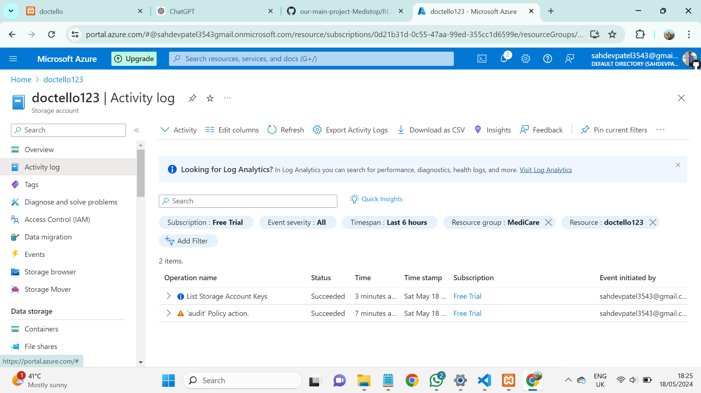
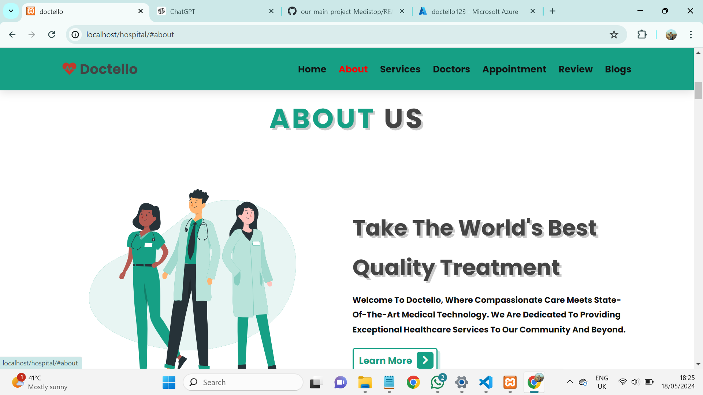
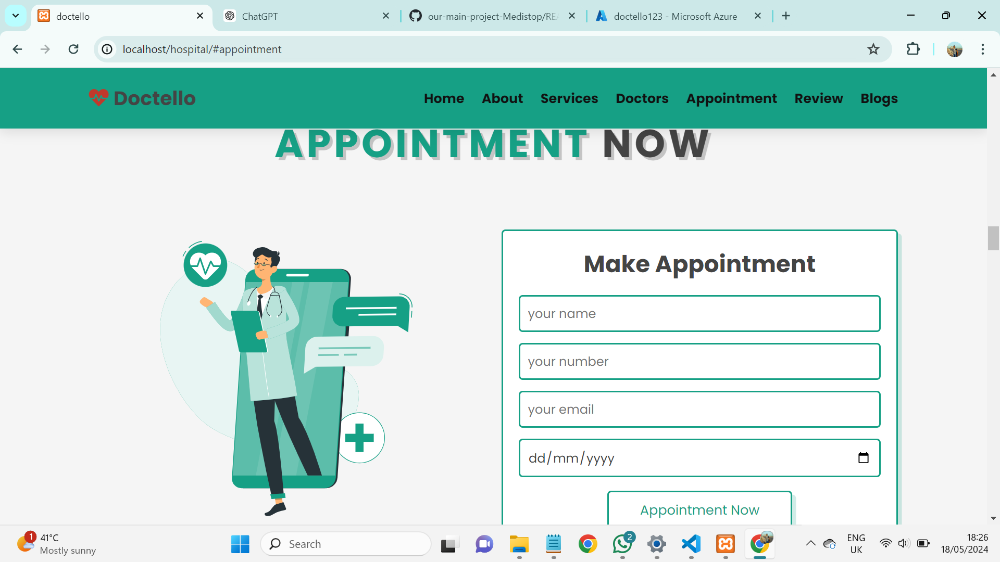
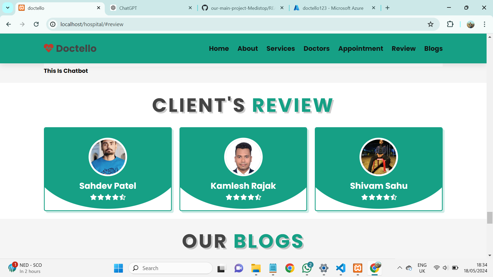

# Doctello (Hospital Management System)

Doctello is a website which is developed as part of **Future Ready Talent Internship**.
Doctello is a healthcare tool for ease of patients and to enhance the their way of living.

**Project Link:** https://medistoprender.onrender.com/home

**Project Demo Link:** https://www.youtube.com/watch?v=3rT0mKtlDeQ

## Key Features

- **Appointment System :** Doctello provide Appointment System using which patients can book the appointment with doctors with there own preferred time slot and day. Gone the time when we need to sit in long queues for our number to come, now you have MediStop to do it all.

- **Health Bot for Analysis of Dibetes:** Using this boat patient can analyze their diabetic conditions whether on the basis of his/her bmi data . It is health bot for ease the life of patients.

## Technologies Used

- HTML
- CSS
- JavaScript
- MySQL

## Azure Technologies Used

- Azure Static Web Apps
- Azure Bot Service
- Azure Health Bot Service
- Azure Storage

# Breakdowns of Azure Technologies 📊:

## Azure Bot Service 🤖

- I have used Azure Bot Service to create the chatbot.
- The chatbot is mainly used to find your diabetic condition according to your Bmi , allowing patient to get quick response.
- It is based on your bmi so this information may be true.
-
- It does not give accurate data.
- The chatbot is deployed using Azure App Service.

## Azure App Service 📱:

- I have used Azure App Service to deploy the chatbot.
- The chatbot is deployed as a web app, allowing it to be integrated into the Doctello website.
- There are various app service plans like `Free`, `Standard` and `Premium` etc. I am using the free one to deploy my chatbot.

## Azure Blob Storage 🗄️

- Azure Blob Storage is used to store the knowledge base for the chatbot.
- I have created many containers to store the website images, chatbot images and the knowledge base files.

## Screen Shots of the Website

### Home Page

### About Page

### Appointment Page

### Review Page

![image]

## Acknowledgements

I would like to express my sincere gratitude to Future Ready Talent, GitHub, and Microsoft Azure for providing me with the opportunity to work on this project.

##

Thank you for your interest in Doctello.
